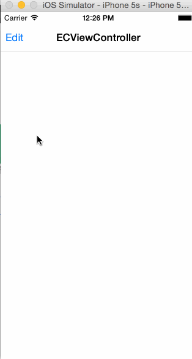

# ECDrawerLayout

[](https://travis-ci.org/Eleven Chen/ECDrawerLayout)
[](http://cocoapods.org/pods/ECDrawerLayout)
[](http://cocoapods.org/pods/ECDrawerLayout)
[](http://cocoapods.org/pods/ECDrawerLayout)

## Overview

A very simple DrawerLayout implemented on the iOS.

## Usage

To run the example project, clone the repo, and run `pod install` from the Example directory first.


## Installation

ECDrawerLayout is available through [CocoaPods](http://cocoapods.org). To install
it, simply add the following line to your Podfile:

```ruby
pod "ECDrawerLayout"
```

## Configuring

```
self.drawerLayout = [[ECDrawerLayout alloc] initWithParentView:self.navigationController.view];
self.drawerLayout.contentView = self.drawerView;
self.drawerLayout.delegate = self;
[self.navigationController.view addSubview:self.drawerLayout];
```
You have to implement a content view yourself, and then add it to drawerLayout's contentView property. Please see the example.

if you want to open from right, set the openFormRight = YES

```
self.drawerLayout.openFromRight = YES;
```

I look forward to the effect that when DrawerLayout display, status bar hidden, like Uber did. :(




## Author

Eleven Chen, skyhacker@126.com

## License

ECDrawerLayout is available under the MIT license. See the LICENSE file for more info.
